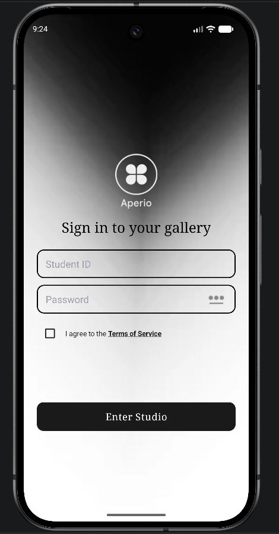
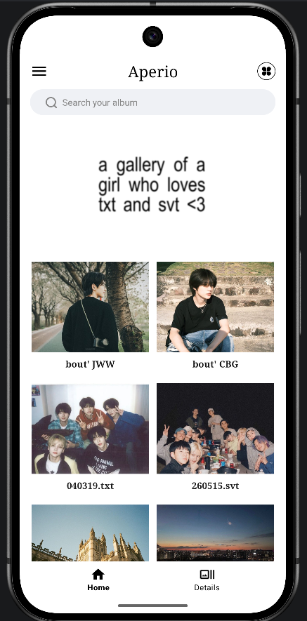
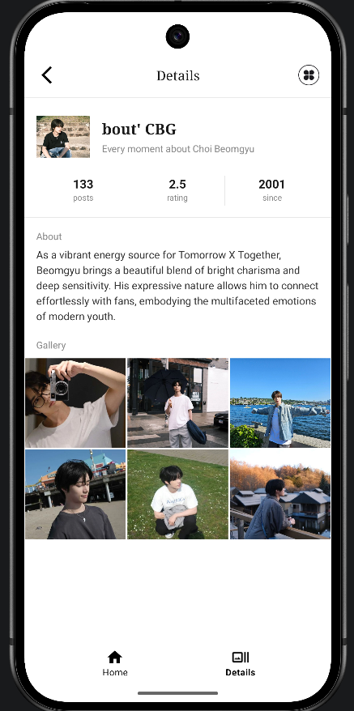

# Aperio - Photography Studio App
### NIT3213 Mobile Application Development — Final Assignment
**Student ID:** s8116504  
**Student Name:** Amy Nguyen  
**Campus:** Sydney  

---

## 📱 App Overview

Aperio is a minimalist photography studio Android application built using modern Android development practices. The app connects to a REST API to display a curated collection of photography styles and techniques, presented through a clean, VSCO-inspired interface.

---

## ✨ Features

- **Login Screen** — Authenticates users via the NIT3213 API using student credentials
- **Dashboard Screen** — Displays a grid of photography styles fetched from the API
- **Details Screen** — Shows full information about a selected photography style including gallery
- **Sliding Drawer Menu** — Navigation drawer accessible from the menu icon
- **Terms of Service** — ToS acknowledgement checkbox on login screen
- **Password Toggle** — Show/hide password on login screen
- **Bottom Navigation** — Consistent navigation bar across dashboard and details screens

---

## 🏗️ Architecture & Tech Stack

| Layer | Technology |
|-------|-----------|
| Language | Kotlin |
| Architecture | MVVM (Model-View-ViewModel) |
| Dependency Injection | Hilt |
| Navigation | Navigation Component + Safe Args |
| Networking | Retrofit 2 + OkHttp |
| JSON Parsing | Gson |
| Async | Kotlin Coroutines + StateFlow |
| UI | XML Views + Material 3 |
| Testing | JUnit 4 + MockK + Coroutines Test |

---

## 📂 Project Structure

```
com.s8116504.assignment2
├── data
│   ├── api
│   │   ├── ApiService.kt          # Retrofit API interface
│   │   └── RetrofitClient.kt      # Retrofit + OkHttp client setup
│   ├── model
│   │   ├── CardDetails.kt         # Details card data class
│   │   ├── Entity.kt              # Dashboard entity data class
│   │   ├── DashboardResponse.kt   # API response model
│   │   ├── LoginRequest.kt        # Login request body
│   │   └── LoginResponse.kt       # Login response with keypass
│   └── repository
│       └── ApiRepository.kt       # Data layer — API calls
├── di
│   └── AppModule.kt               # Hilt dependency injection module
├── ui
│   ├── login
│   │   └── LoginViewModel.kt      # Login state management
│   └── dashboard
│       ├── DashboardViewModel.kt  # Dashboard state management
│       └── EntityAdapter.kt       # RecyclerView adapter
├── LoginFragment.kt               # Login screen
├── DashboardFragment.kt           # Dashboard screen
├── DetailsFragment.kt             # Details screen
├── MainActivity.kt                # Single activity host
└── MyApplication.kt               # Hilt application class
```

---

## 🔌 API Details

**Base URL:** `https://nit3213api.onrender.com/`

| Endpoint | Method | Description |
|----------|--------|-------------|
| `/sydney/auth` | POST | Login with student credentials |
| `/dashboard/{keypass}` | GET | Fetch dashboard entities |

**Login Request:**
```json
{
  "username": "s8116504",
  "password": "Amy"
}
```

**Login Response:**
```json
{
  "keypass": "fashion"
}
```

**Dashboard Response:**
```json
{
  "entities": [
    {
      "property1": "value1",
      "property2": "value2",
      "description": "Detailed description"
    }
  ],
  "entityTotal": 7
}
```

---

## 🧪 Unit Tests

Tests are located in `app/src/test/java/com/s8116504/assignment2/`

| Test File | Tests |
|-----------|-------|
| `LoginViewModelTest.kt` | Login success, login failure, initial idle state |
| `DashboardViewModelTest.kt` | Fetch success, fetch failure, entity count, initial idle state |

**Run tests:**
```bash
./gradlew testDebugUnitTest
```

---

## 🚀 How to Run
> **Note:** The API is hosted on Render's free tier and may be in sleep mode.
> Before logging in, please wake the server by visiting:
> [https://nit3213api.onrender.com/](https://nit3213api.onrender.com/)
> Wait until the page loads (may take 30–60 seconds), then launch the app.
> 
1. Clone the repository
```bash
git clone https://github.com/myitzmie/S8116504-Assignment2.git
```

2. Open in Android Studio

3. Sync Gradle

4. Run on emulator or physical device (API 24+)

5. Login with:
   - **Username:** s8116504
   - **Password:** Amy

---

## 📸 Screenshots

| Login | Dashboard | Details |
|-------|-----------|---------|
|  |  |  |

---

## 🎨 Design

The app follows **Material 3 (Material You)** design guidelines with a minimalist, VSCO-inspired aesthetic:

- Dark gradient login background
- Clean white dashboard with image grid
- Instagram-style details layout with gallery grid
- Consistent black/white colour palette
- Serif typography for artistic feel

---

## 📦 Dependencies

```gradle
// Retrofit (API calls)
    implementation("com.squareup.retrofit2:retrofit:3.0.0")
    implementation("com.squareup.retrofit2:converter-gson:3.0.0")

    // Coroutines
    implementation("org.jetbrains.kotlinx:kotlinx-coroutines-core:1.11.0")
    implementation("org.jetbrains.kotlinx:kotlinx-coroutines-android:1.11.0")

    // View Model
    implementation("androidx.lifecycle:lifecycle-viewmodel-ktx:2.11.0")
    implementation("androidx.lifecycle:lifecycle-runtime-ktx:2.11.0")

    // LiveData
    implementation("androidx.lifecycle:lifecycle-livedata-ktx:2.11.0")

    //Hilt
    implementation("com.google.dagger:hilt-android:2.60.1")
    ksp("com.google.dagger:hilt-android-compiler:2.60.1")

    //Recycleview
    implementation("androidx.recyclerview:recyclerview:1.4.0")

    //Material
    implementation("com.google.android.material:material:1.14.0")

    //Navigation component
    implementation("androidx.navigation:navigation-fragment-ktx:2.9.8")
    implementation("androidx.navigation:navigation-ui-ktx:2.9.8")
    implementation("com.squareup.okhttp3:logging-interceptor:4.12.0")

    //Drawer Layout
    implementation("androidx.drawerlayout:drawerlayout:1.2.0")

    // Testing
    testImplementation("io.mockk:mockk:1.14.11")
    testImplementation("io.mockk:mockk-android:1.14.11")
    testImplementation("io.mockk:mockk-agent:1.14.11")
    testImplementation(libs.junit)
    testImplementation("org.jetbrains.kotlinx:kotlinx-coroutines-test:1.11.0")
    testImplementation("androidx.arch.core:core-testing:2.2.0")
```
## ⚠️ Troubleshooting

### API Connection Error ("Unable to resolve host")
When first opening the app or clicking **'Enter Studio'**, you may see a red error message stating:
`Unable to resolve host 'nit3213api.onrender.com': No address associated with hostname`

#### Step 1: Wake up the Server
* **Why this happens:** The backend server is hosted on a free Render tier, which automatically spins down (goes to sleep) after periods of inactivity.
* **How to fix:** Simply wait **30 to 60 seconds** for the server to wake up, then press the **'Enter Studio'** button again. The app will connect cleanly once the server is active.

#### Step 2: Test Emulator Internet Connection (If Step 1 fails)
If you have waited and the error still won't disappear, the Android Virtual Device (AVD) may have lost its network path:
1. Minimize the app and open the **Chrome browser** inside your emulator.
2. Navigate to: `https://nit3213api.onrender.com/`
3. Check the behavior:
   * **If it loads a message or page:** The internet is working. Completely restart your assignment application and press **'Enter Studio'** again.
   * **If it fails to load:** The emulator itself has no network access. Wipe data or cold-boot your emulator inside Android Studio's Device Manager, check your computer's internet, and try again.
  
### Other issues and solutions

| Problem | Cause | Solution |
|---------|-------|----------|
| **App crashes on launch** | Missing INTERNET permission | Check `AndroidManifest.xml` has `<uses-permission android:name="android.permission.INTERNET" />` |
| **RecyclerView empty** | Keypass not passed correctly | Check Logcat for `DASH_DEBUG` tag to verify keypass is received |
| **Purple button color** | Material theme override | Add `style="@style/Widget.MaterialComponents.Button.UnelevatedButton"` and `app:backgroundTint="@null"` to button |
| **Build failed - kapt error** | Incompatible Kotlin version | Use `ksp` instead of `kapt` for Hilt compiler |
| **Navigation safe args error** | Version mismatch | Ensure safe args plugin version matches navigation dependency version |
| **Emulator installation failed** | Broken pipe / connection drop | Run `adb kill-server` then `adb start-server` in terminal |
| **@Parcelize unresolved** | Plugin not applied | Add `id("kotlin-parcelize")` to plugins block in `build.gradle.kts` |
| **Dashboard shows empty after login** | API field names don't match model | Make `EntityResponse` fields nullable with `String? = null` |


---

## 👩‍💻 Author

**Amy Nguyen** — s8116504  
Victoria University, Sydney Campus  
NIT3213 Android Application Development
